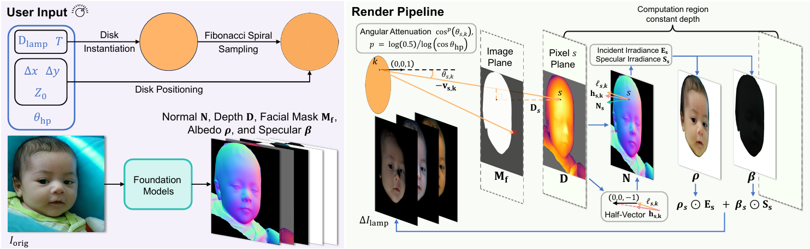
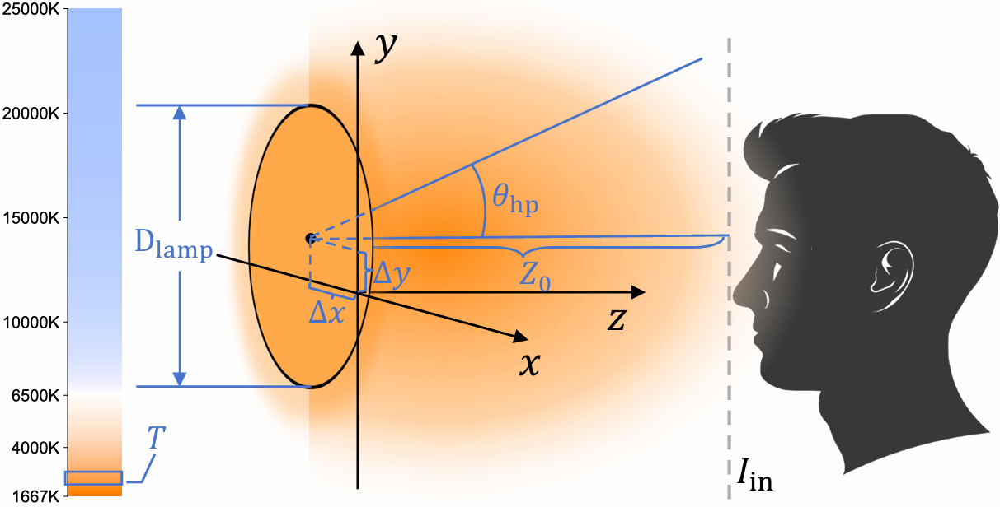
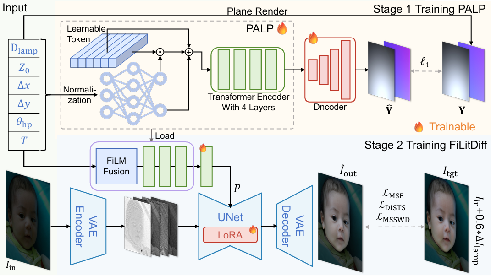
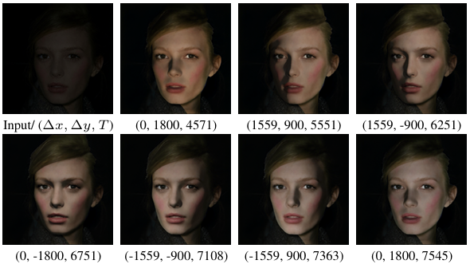
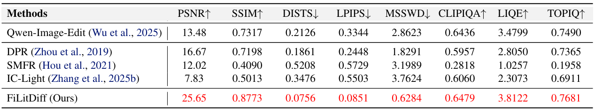
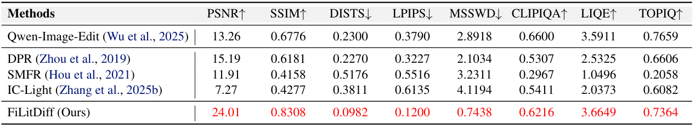
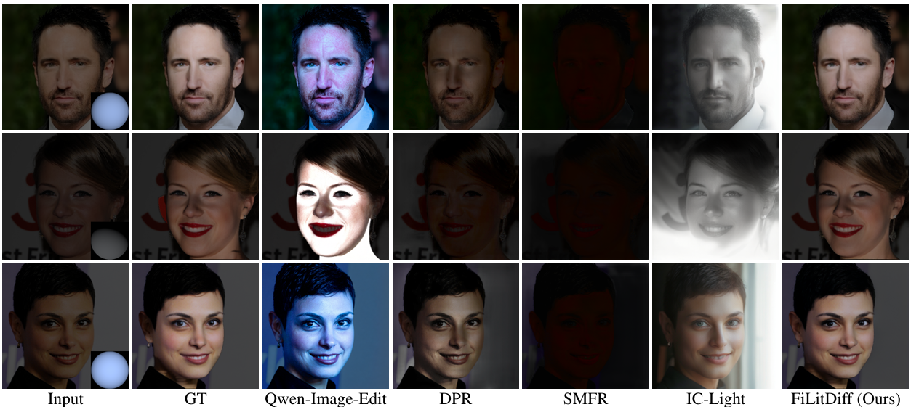
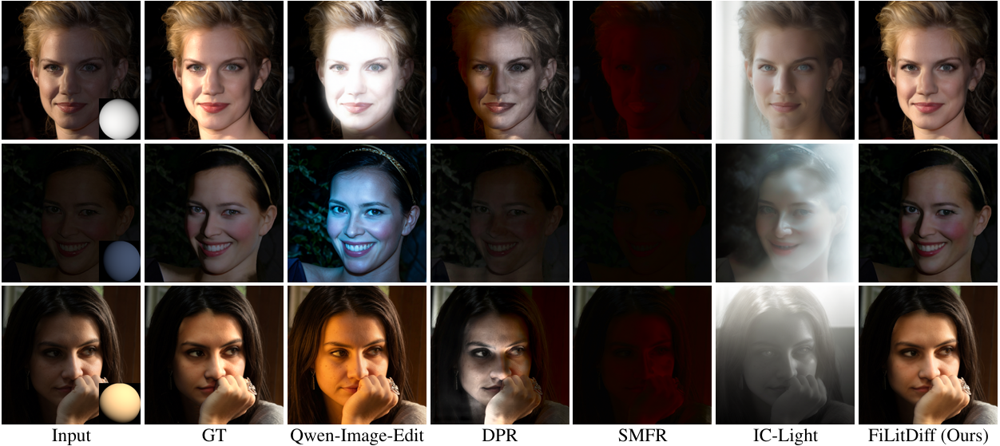

<h1 align="center">
Light Up Your Face: A Physically Consistent Dataset<br>and Diffusion Model for Face Fill-Light Enhancement
</h1>


<p align="center">
<a href="https://github.com/gobunu">Jue Gong</a>, 
<a href="https://github.com/littletoilet">Zihan Zhou</a>, 
<a href="https://github.com/jkwang28">Jingkai Wang</a>, 
Xiaohong Liu,  
<a href="http://yulunzhang.com/">Yulun Zhang</a>, 
<a href="https://scholar.google.com/citations?user=yDEavdMAAAAJ">Xiaokang Yang</a>
</p>

<p align="center">
"We propose a physically grounded one-step diffusion method for face fill-light enhancement, trained on our 160K-pair dataset with 6D area-disk lighting control and physics-aware conditioning.", 2026
</p>

<p align="center">
  <a href="https://arxiv.org/abs/2602.04300">
    
  </a>
  <a href="https://github.com/gobunu/Light-Up-Your-Face/releases/download/Paper/LightFace_supp.pdf">
    
  </a>
  <a href="https://github.com/gobunu/Light-Up-Your-Face/releases">
    
  </a>
  <a href="https://github.com/gobunu/Light-Up-Your-Face">
    
  </a>
  <a href="https://github.com/gobunu/Light-Up-Your-Face">
    
  </a>
</p>


#### 🔥🔥🔥 News

- **2025-02-05:** This repo is released.
---

> **Abstract:** Face fill-light enhancement (FFE) brightens underexposed faces by adding virtual fill light while keeping the original scene illumination and background unchanged. Most face relighting methods aim to reshape overall lighting, which can suppress the input illumination or modify the entire scene, leading to foreground-background inconsistency and mismatching practical FFE needs. To support scalable learning, we introduce LightYourFace-160K (LYF-160K), a large-scale paired dataset built with a physically consistent renderer that injects a disk-shaped area fill light controlled by six disentangled factors, producing 160K before-and-after pairs. We first pretrain a physics-aware lighting prompt (PALP) that embeds the 6D parameters into conditioning tokens, using an auxiliary planar-light reconstruction objective. Building on a pretrained diffusion backbone, we then train a fill-light diffusion (FiLitDiff), an efficient one-step model conditioned on physically grounded lighting codes, enabling controllable and high-fidelity fill lighting at low computational cost. Experiments on held-out paired sets demonstrate strong perceptual quality and competitive full-reference metrics, while better preserving background illumination.

<p align="center">
  <br>
   Overview of our physically consistent dataset pipeline and fill-light renderer.
</p>

<div align="center">
  <table>
    <tr>
      <td align="center">
        <br>
         Lighting parameterization.
      </td>
      <td align="center">
        <br>
        Overall training framework.
      </td>
    </tr>
  </table>
</div>

---

<p align="center">
  <br>
   Fill-light control. We move a virtual light along a circular path and increase color temperature, with fixed beam shape. Labels show (Δx, Δy, T) in pixels and Kelvin.
</p>


---

## ⚒️ TODO

* [ ] Release code and pretrained models.
* [ ] Release LYF-160K training data, and LYF-Val and LYF-EditVal sets.

## 🔗 Contents

- [ ] Models
- [ ] Test Set
- [ ] Training
- [x] [Results](#results)
- [x] [Citation](#citation)
- [ ] [Acknowledgements](#acknowledgements)


## <a name="results"></a>🔎 Results

The model **FiLitDiff** achieved state-of-the-art performance on both the datasets **LYF-Val** and **LYF-EditVal**. Detailed results can be found in the paper.

<details>
<summary>&ensp;Quantitative Comparisons (click to expand) </summary>
<li style="margin-left: 2rem;"> Table 1: Quantitative evaluation on LYF-Val from the main paper. We report representative relighting baselines and a prompt-based editing reference that injects lighting instructions via prompts.
<p align="center">

</p>
</li>
<li style="margin-left: 2rem;"> Table 2: Quantitative evaluation on LYF-EditVal from the main paper. We report representative relighting baselines and a prompt-based editing reference that injects lighting instructions via prompts.
<p align="center">

</p>
</li>
</details>

<details>
<summary>&ensp;Visual Comparisons (click to expand) </summary>
<li style="margin-left: 2rem;"> Figure 6: Visual comparison on LYF-Val.
<p align="center">

</p>
</li>
<li style="margin-left: 2rem;"> Figure 7: Visual comparison on LYF-EditVal.
<p align="center">

</p>
</li>
</details>


## <a name="citation"></a>📎 Citation

If you find the code helpful in your research or work, please cite the following paper.

```bibtex
@article{gong2026lightface,
    title={{Light Up Your Face: A Physically Consistent Dataset and Diffusion Model for Face Fill-Light Enhancement}},
    author={Gong, Jue and Zhou, Zihan and Wang, Jingkai and Liu, Xiaohong and Zhang, Yulun and Yang, Xiaokang},
    journal={arXiv preprint 2602.04300},
    year={2026}
}
```


## <a name="acknowledgements"></a>💡 Acknowledgements

[TBD]

<!--  -->
